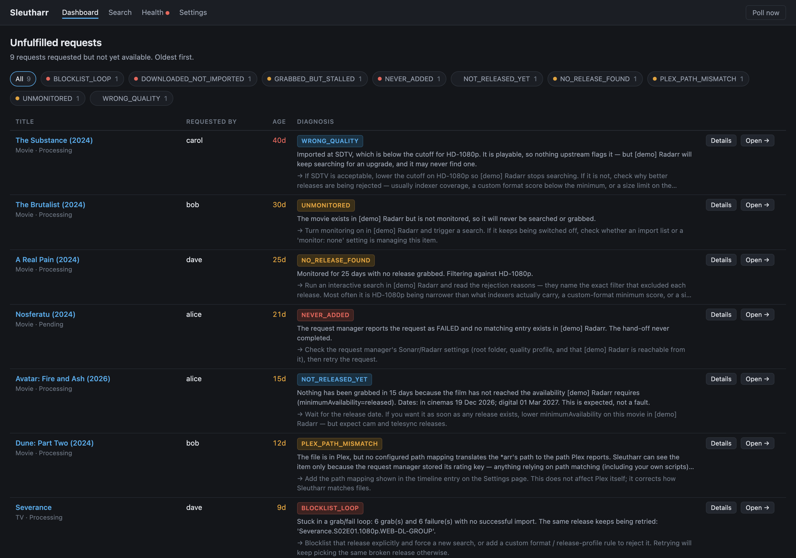
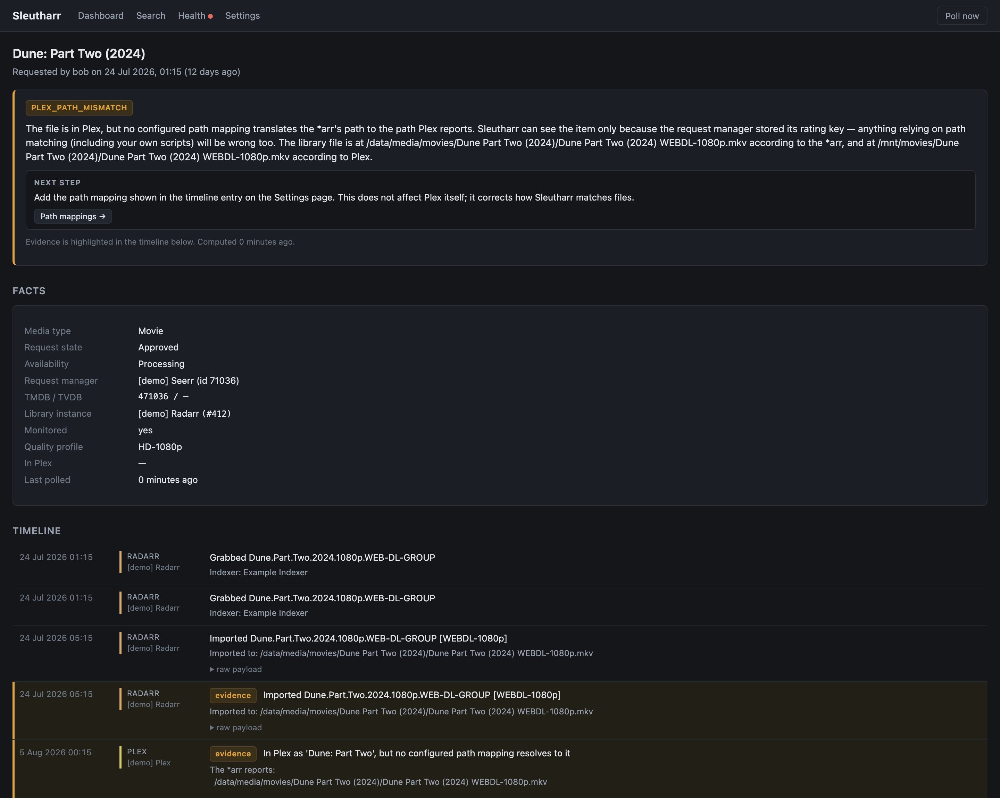
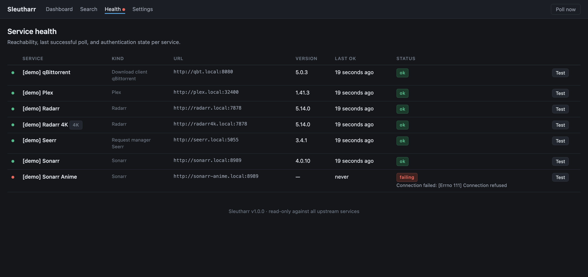
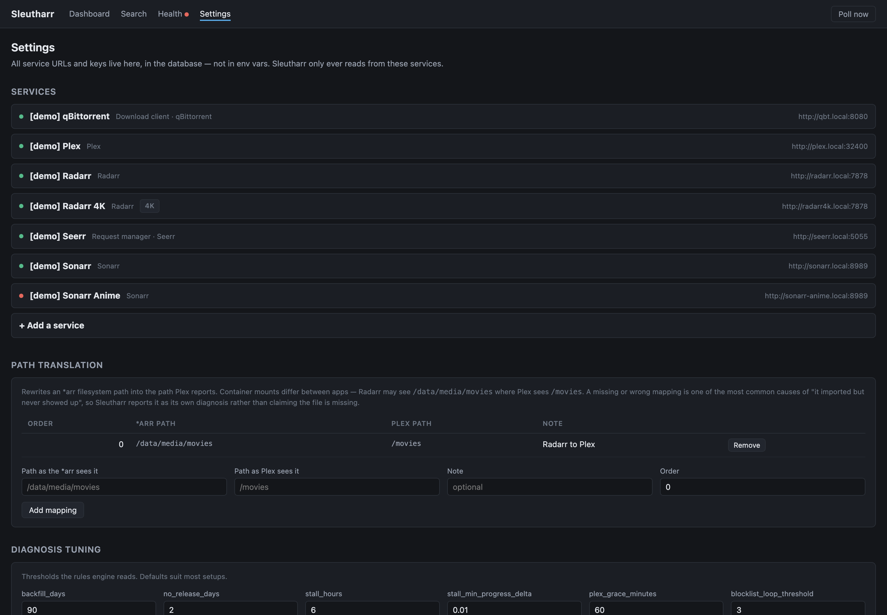

# Sleutharr

**"I requested this — where did it die?"**

Sleutharr stitches a single media request into one timeline across your request manager,
Sonarr/Radarr, your download client and your media server, then tells you where the chain
broke and what to do about it.

It is **read-only by default**. The one exception is a "remove & blocklist" button for
stuck downloads, which always asks first and never runs on its own. See
[Fixing things](#fixing-things).



---

## Why this exists

The *arr stack is excellent at each individual job and gives you nothing that spans them.
When a request never arrives, the answer is somewhere in five different UIs, and the
symptom rarely matches the cause:

- Sonarr says "no results" — because the item is unmonitored.
- The download client shows 100% — because the import failed on a hardlink error.
- The *arr says "imported" — because Plex mounts that folder at a different path.

Sleutharr's output is a **single verdict per request**, with the evidence that supports it
and the specific next action. Anything that does not serve that verdict is out of scope.

## Supported services

| Role | Supported |
|---|---|
| Request manager | **Seerr** (primary), Overseerr, Jellyseerr, Ombi |
| Library | Sonarr, Radarr — any number of instances, including 4K splits |
| Download client | qBittorrent, Transmission, Deluge, SABnzbd, NZBGet |
| Media server | Plex, Jellyfin, Emby |

Adding a product never touches the diagnosis layer: the rules reason about the *role* a
service plays in the chain, not the product filling it.

Two capability differences are worth knowing before you pick:

* **Ombi** records no link between a request and the Sonarr/Radarr record it became, and
  has no 4K lane. Sleutharr falls back to matching on TMDB/TVDB id, and softens the
  "never added" verdict accordingly rather than claiming a hand-off failed when it cannot
  actually tell. Seerr-family managers give a much stronger join.
* **Jellyfin/Emby** expose `ProviderIds`, so the id join works without anything stored on
  the request manager's side. Plex needs the rating key the request manager recorded.

### Related projects

- **[arr-dashboard](https://github.com/Kha-kis/arr-dashboard)** aggregates the same
  upstream data across many instances, presented per-service. Sleutharr deliberately does
  not duplicate that scope — it presents one causal timeline per *request* and a verdict.
- **[Toolbarr](https://github.com/Notifiarr/toolbarr)** repairs Starr databases.
  Complementary: Toolbarr fixes, Sleutharr diagnoses.

---

## The diagnoses

| Code | Severity | Means |
|---|---|---|
| `NEVER_ADDED` | error | Approved, but no Sonarr/Radarr entry exists. The hand-off failed. |
| `NO_ARR_INSTANCE` | warning | The request is not routed to any configured *arr instance. |
| `DECLINED` | info | Declined in the request manager. Nothing will happen. |
| `UNMONITORED` | warning | The entry exists but monitoring is off, so it will never be searched. |
| `BLOCKLIST_LOOP` | error | Repeated grab → fail cycles with no successful import. |
| `DOWNLOADED_NOT_IMPORTED` | error | The client finished; the import is blocked. Quotes the *arr's error. |
| `DOWNLOAD_CLIENT_ERROR` | error | The client reports `error` or `missingFiles`. |
| `GRABBED_BUT_STALLED` | warning | In the client, no meaningful progress, or zero seeds. |
| `PATH_MISMATCH` | warning | The media server has the file, but no path mapping resolves to it. |
| `NOT_IN_MEDIA_SERVER` | warning | Imported past the grace period, still absent from the media server. |
| `WRONG_QUALITY` | info | Imported below the profile cutoff but marked available. The silent one. |
| `NOT_RELEASED_YET` | info | Nothing grabbed because no release exists yet. Expected, not a fault. |
| `NEVER_SEARCHED` | warning | Monitored and available, but the *arr never ran a search. |
| `NO_RELEASE_FOUND` | warning | Searched, nothing passed the quality profile's filters. |

Rules are evaluated in priority order and **the first match wins**, so you get the root
cause rather than its symptoms. An unmonitored movie reports `UNMONITORED`, not
`NO_RELEASE_FOUND`, even though both technically apply.



Every diagnosis links to the exact record in the app that owns the fix, and highlights the
timeline events it was derived from.

---

## Install

### Docker

```bash
docker run -d --name sleutharr \
  -p 8080:8080 \
  -e PUID=1000 -e PGID=1000 -e TZ=Etc/UTC \
  -v ./config:/config \
  ghcr.io/dsopinka/sleutharr:latest
```

Or with compose, which builds from source instead of pulling:

```bash
docker compose up -d
```

Then open `http://localhost:8080` and add your services on the Settings page.

### Unraid

**→ [Full Unraid install guide](docs/unraid.md)**

**Docker → Add Container**, then:

| Field | Value |
|---|---|
| Repository | `ghcr.io/dsopinka/sleutharr:latest` |
| Port | `8080` → `8080` |
| Path | `/config` → `/mnt/user/appdata/sleutharr` |
| Variables | `PUID=99`, `PGID=100`, `TZ=…` |

Or drop [`unraid/sleutharr.xml`](unraid/sleutharr.xml) into
`/boot/config/plugins/dockerMan/templates-user/` and pick it from the template list.
Updates are **Check for Updates → Apply**.

The guide covers the details that actually bite: why `localhost` in a service URL never
works from inside the container, routing 4K requests to the right instance, and naming
usenet clients when you run more than one.

### From source

```bash
python3.12 -m venv .venv && .venv/bin/pip install -r requirements.txt
SLEUTHARR_CONFIG_DIR=./config .venv/bin/python manage.py migrate
SLEUTHARR_CONFIG_DIR=./config .venv/bin/python manage.py runserver 8080
```

### Environment variables

Only deployment concerns are env vars. **Every service URL and API key is configured in
the web UI** and stored in SQLite.

| Variable | Default | Purpose |
|---|---|---|
| `PUID` / `PGID` | `1000` | Ownership of files written to `/config`. |
| `TZ` | `UTC` | Affects displayed timestamps. |
| `SLEUTHARR_CONFIG_DIR` | `/config` | Database, secret key, logs. |
| `SLEUTHARR_CSRF_TRUSTED_ORIGINS` | — | Only needed behind an HTTPS reverse proxy. |
| `SLEUTHARR_SCHEDULER` | `1` | Set `0` to run the UI without the poller. |
| `SLEUTHARR_SECRET_KEY` | generated | Persisted to `/config/secret_key` if unset. |

---

## Configuration

### Media server

**Settings → Media server → Sign in with Plex.** A Plex window opens, you approve it, and
your servers are listed to pick from — no `X-Plex-Token` to dig out of an XML response.
Sleutharr stores the *server-scoped* token from that list rather than your account token,
and prefers your LAN address over Plex's relay.

Jellyfin and Emby have no such flow, so they take a username and password instead. The
password is used once to obtain an access key and then discarded; only the key is stored.

Signing in with Plex is the one feature that needs outbound internet, since the PIN flow
goes through plex.tv. Everything else stays on your network.

### Services

Add one request manager, then each Sonarr/Radarr instance, your download clients, and your
media server. The form adapts to what you pick — choosing a kind narrows the product list
and hides fields that do not apply. Use **Test** on the Health page to verify each one
before relying on it.

**If you run more than one usenet client**, set each one's *name inside Sonarr/Radarr*.
SABnzbd and NZBGet download ids are only unique within a single instance — NZBGet hands out
plain integers like `42` — so Sleutharr matches queue rows by the client name the *arr
reports. Torrent clients use globally-unique infohashes and need nothing extra.



### Multiple *arr instances (4K splits)

If you run separate 4K and 1080p instances, set each instance's **request manager service
id** to the `serviceId` that the request manager uses for it (its position in the request
manager's Sonarr/Radarr settings list, starting at 0), and tick **handles the 4K lane** on
the 4K one.

This matters more than it looks. Seerr stores every join key twice — `serviceId` /
`serviceId4k`, `externalServiceId` / `externalServiceId4k`, `ratingKey` / `ratingKey4k` —
and `is4k` on the request selects which half applies. A 4K request and a 1080p request for
the same title share one media record and routinely point at **different instances**.
Getting this wrong does not produce an error; it produces a confident, wrong diagnosis.

### Path translation



Radarr may see `/data/media/movies` where Plex sees `/movies`, because the two containers
mount the same storage at different points. No API exposes this — it is deployment
configuration, so you have to tell Sleutharr about it.

You usually do not have to work it out yourself. When Sleutharr can see an item in the
media server by id but no path resolves to it, it reports `PATH_MISMATCH` and names the
exact prefix pair that would fix it. Paste that into the mapping table.

---

## Fixing things

Sleutharr is a diagnostic tool, not an automation tool. It performs exactly one kind of
write, and only when you click it and confirm:

**Remove & blocklist** appears on any request with a stuck queue entry. It:

1. deletes the partially-downloaded files from the download client,
2. blocklists the release so the *arr will not grab it again,
3. lets the *arr search for a different release itself.

The removal is sent to Sonarr/Radarr rather than straight to the download client, so the
*arr stays consistent with its own queue and history. Every action is recorded in an audit
log on the Settings page and on the request's own timeline.

### Why there is no auto-remove

It was considered and deliberately left out. Diagnosis rules are heuristics over five
services that disagree with each other in small ways, and they will misfire — during
development, a bug in the stall rule read "tracker withheld the swarm count" as "zero
seeds", which would have condemned every healthy private-tracker torrent. That bug was
caught by a test. Had it been wired to a delete key, it would have destroyed real
downloads first and been noticed afterwards.

A wrong badge costs you ten seconds. A wrong deletion costs you the download, and the
blocklist means the *arr will not fetch that release again. The asymmetry is not close, so
the human stays in the loop.

There is also a **search again** button, off by default, under Settings. It is usually
unnecessary: removing with blocklist already makes the *arr search for a replacement. It
exists for the case where nothing was ever grabbed at all.

---

## How the join works

```
Request manager               Sonarr / Radarr         Download client      Media server
────────────────              ───────────────         ───────────────      ────────────
MediaRequest.is4k ─selects─►  externalServiceId[4k] ─► downloadId ───────► ratingKey[4k]
                              (movieId / seriesId)     (see below)          or ProviderIds
   │                                 │                      │                    │
   └── tmdbId / tvdbId ──fallback────┘                      │                    │
       (always, on Ombi)                                    └── path mappings ────┘
```

`downloadId` is **not** one kind of value, which is the single easiest thing to get wrong
here. Read from Sonarr's own client implementations:

| Client | `downloadId` is |
|---|---|
| qBittorrent / Transmission / Deluge | the infohash, uppercased by the *arr |
| SABnzbd | an opaque `nzo_id` string |
| NZBGet | **a decimal integer**, unique only within one instance |

1. **Request manager → *arr.** `serviceId` picks the instance, `externalServiceId` the
   record — both read from the 4K-aware half of the pair. Falls back to `tmdbId`/`tvdbId`
   when null, which is exactly the case when the push to the *arr failed — and that is
   itself the `NEVER_ADDED` diagnosis.
2. ***arr → history.** Per-entity history is the spine of the timeline.
3. ***arr → download client.** Ids are normalised case-insensitively and, for usenet,
   scoped to the client the *arr named on the queue row — otherwise NZBGet id `42` on one
   host matches an unrelated NZB on another.
4. ***arr → media server.** Both an id join and a path match, because running both is
   what distinguishes "not scanned yet" from "wrong path mapping". Plex uses the stored
   rating key; Jellyfin and Emby use `ProviderIds`.

Full API details, including several places where the published documentation is wrong, are
in [`docs/api-notes.md`](docs/api-notes.md).

---

## Polling

- Every service polls on its own interval (default 60s), paced independently.
- One in-flight request per service, ever.
- Exponential backoff on 5xx and connection failures; auth failures back off hard, because
  a bad API key does not fix itself and hammering qBittorrent with one gets you IP-banned.
- First run backfills to a configurable cutoff (default 90 days), then only reads forward.
- History pages already stored are never re-fetched.

Every event is stored with its **raw API payload**. Diagnosis rules change; re-deriving a
verdict from stored payloads beats re-polling history that may have aged out upstream. That
also means changing a threshold re-diagnoses your whole backlog on the next cycle without
touching any upstream service.

---

## Adding a diagnosis rule

One file, then one line. Rules do no I/O — everything they need is already in the timeline.

```python
# core/rules/r09_my_rule.py
from core.models import EventType, Severity
from core.rules.base import Rule, RuleContext, Verdict


class MyRule(Rule):
    code = "MY_RULE"
    severity = Severity.WARNING

    def evaluate(self, ctx: RuleContext) -> Verdict | None:
        if not ctx.has(EventType.GRABBED):
            return None
        return self.verdict(
            "What is wrong, in one sentence.",
            next_step="The specific thing to do about it.",
            link=ctx.arr_url(),
            evidence=ctx.grabs[-1:],
        )
```

Then add it to `RULES` in `core/rules/__init__.py`, in priority order.

---

## Development

```bash
SLEUTHARR_CONFIG_DIR=./config SLEUTHARR_SCHEDULER=0 .venv/bin/python manage.py test core
```

197 tests, no live calls — client parsing runs against recorded fixtures in
`core/tests/fixtures/`, and the ingestion tests use `httpx.MockTransport`. There are no
test-only dependencies.

To exercise the UI without a real setup:

```bash
SLEUTHARR_CONFIG_DIR=./config .venv/bin/python manage.py seed_demo
```

To check your assumptions against live instances once they are configured:

```bash
SLEUTHARR_CONFIG_DIR=./config .venv/bin/python manage.py probe_services --verify
```

`--verify` prints the actual field names each service returns, including whether the
4K-suffixed keys are present. `docs/api-notes.md` was written from upstream specs and
source, not from a running server; this command is how you close that gap.

### Stack

Python 3.12, Django 5.2, DRF, SQLite in WAL mode, APScheduler in-process, httpx, and
server-rendered templates with HTMX. One container, one process, no broker, no Postgres,
no JS build step. htmx is vendored, so the UI needs no outbound internet.

---

## Limitations

- **Season-level granularity for TV is coarse.** A partially-grabbed season is diagnosed
  from the series' history as a whole, not per episode.
- **rTorrent/ruTorrent is not supported.** Its XML-RPC interface is different enough to
  need its own client; the `DownloadClient` interface has room for it.
- **Ombi's join is weaker than the Seerr family's** — see Supported services above.
- **No live upstream instance was available during development**, so all API behaviour
  comes from upstream specs and source rather than a running server. The `linux/amd64`
  image itself *was* built and run: it starts as `uid=99 gid=100`, migrates, persists
  `/config` across restarts, serves every page, reaches `healthy`, and passes all 149
  tests inside the image.
- **No live upstream instance was available** during development. All API behaviour was
  verified against upstream OpenAPI schemas and source code rather than a running server;
  see the `[UNVERIFIED-LIVE]` markers in `docs/api-notes.md` for the specific items worth
  confirming with `probe_services --verify`.

## License

MIT
